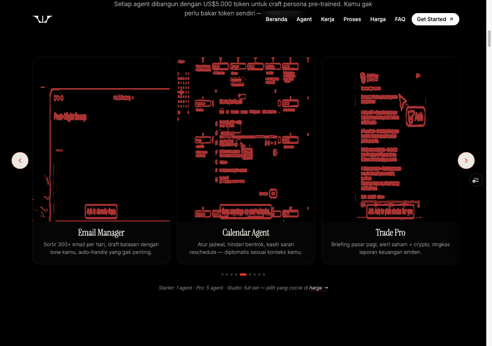
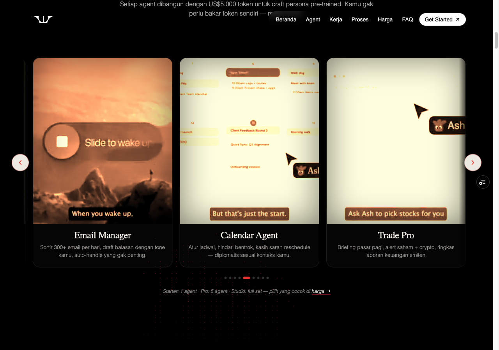
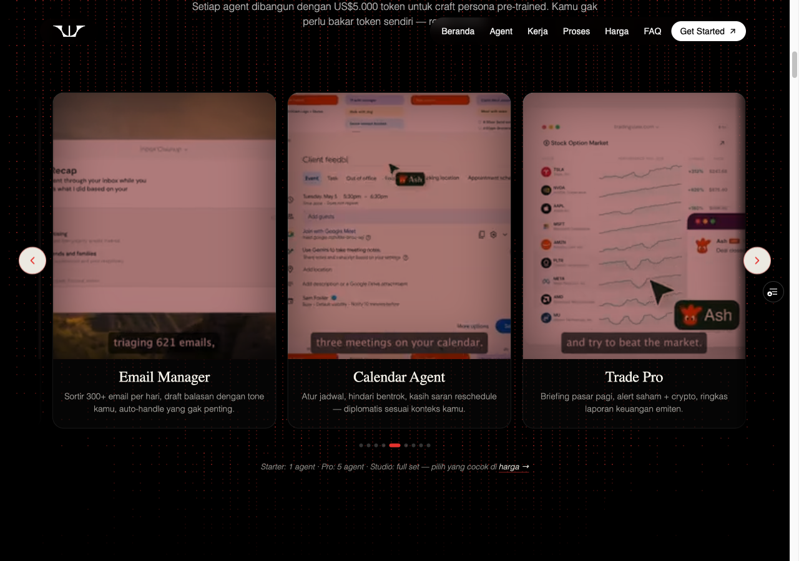
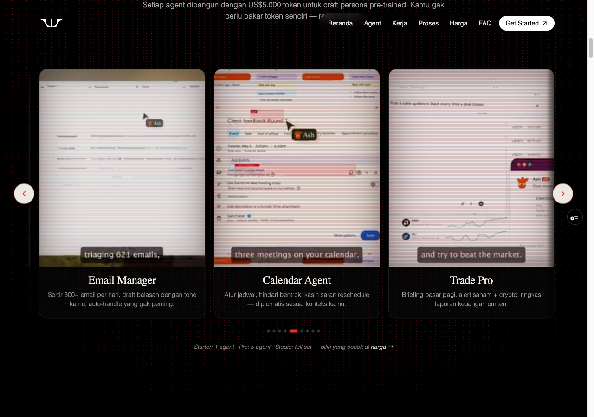
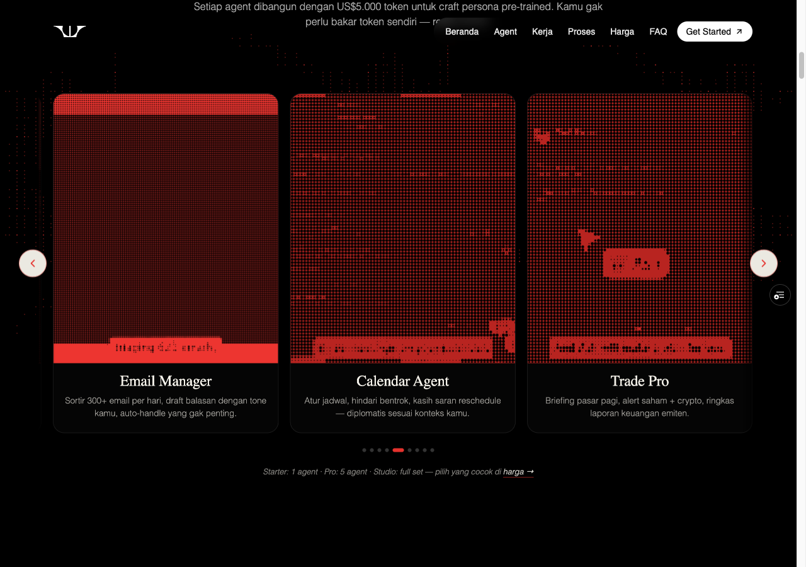
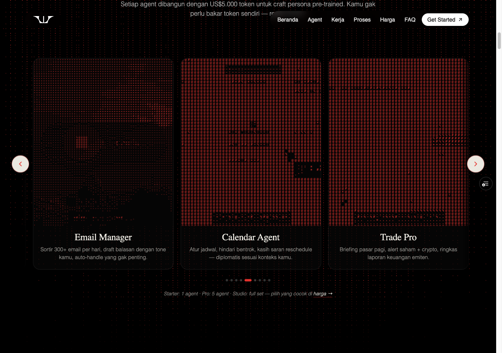
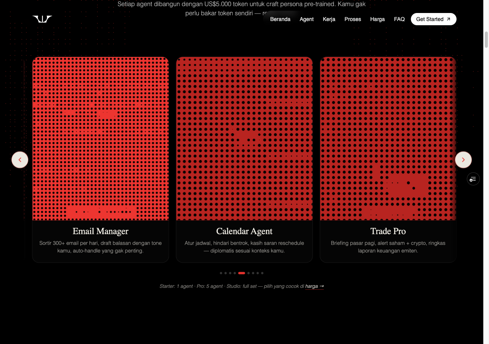
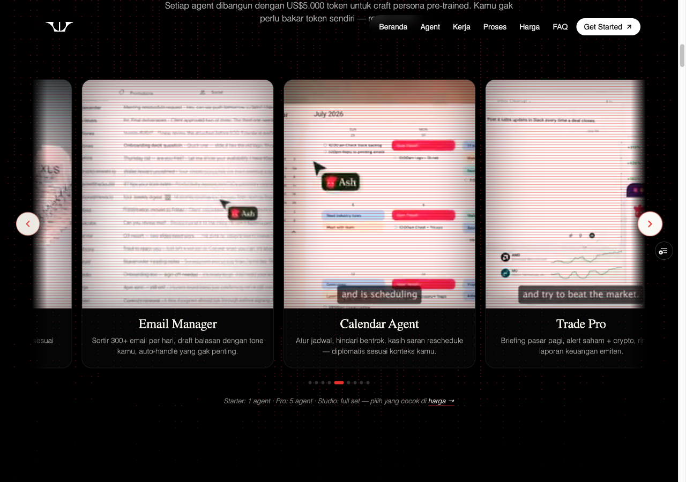

# Agent Carousel — Treatment Comparison

**Status:** Side-by-side exploration sprint, founder review pending.
**Date:** 2026-05-09 (round 4 — founder's hand-built GIFs as raw mp4 playback; **final direction**)
**Scope:** Compare candidate visual treatments for the agent persona carousel inside the "Era baru / Fine-tuned agent yang ngerjain. Bukan chatbot yang cuma jawab." section. Pick a winner, that branch becomes the merge candidate.

> **Round 4 update (2026-05-09):** Founder hand-built 9 oxblood-on-black wireframe GIFs (one per persona) — the exact aesthetic we were trying to generate via Sobel edge detection in round 3. Drop all generated visual treatments (halftone, ASCII, LED, scanline, duotone, multiply, glow, edge detection) and just play the founder's GIFs as raw mp4 directly. Branch: `feat/agent-carousel-richie-gifs`. **This is the final direction.** See Round 4 section below.
>
> **Round 3 (earlier 2026-05-09):** Sobel edge detection treatment was the recommended winner of generated approaches — but founder's hand-built GIFs in round 4 supersede the need for any per-frame processing. T5 stays archived as a fallback if the founder ever wants to apply edge detection to non-wireframe source content.
>
> **Round 2:** Three brand-overlay sub-treatments (duotone, multiply, glow). Multiply (B) was the round-2 pick but duotone (A) reading as overexposed catalyzed the round-3 pivot to edge detection.

---

## TL;DR — recommended winner

**Round 4: Founder's hand-built GIFs played as raw mp4 (`feat/agent-carousel-richie-gifs`)** — see Round 4 section below.

Why this beats every prior treatment: the founder hand-crafted exactly the visual identity we were trying to generate via per-frame processing (oxblood-on-black wireframe aesthetic). Hand-built > algorithmically derived for this stake of brand expression — every frame is intentional, no thresholds to tune, no source-video edge cases. We just play them.

Other wins:
- **Zero per-frame processing** — no canvas pipeline, no WebGL shader, no CSS filter chains. Native `<video>` decode, hardware-accelerated by default, IntersectionObserver-gated.
- **Smallest implementation** — `AgentVisual` is now ~20 lines (was 70+ for ScanlineVideo, 350+ for EdgeVideo).
- **Smallest asset weight** — 9 mp4s × 0.9-2.0 MB = ~17 MB total (was 53 MB pre-compression in round 1)
- **Easiest to maintain** — founder just ships new GIFs + we ffmpeg them; no code changes for visual updates.

Earlier rounds stay documented below as the reasoning archive.

---

## Round 4 — Founder's hand-built GIFs (FINAL DIRECTION)

**Treatment 6 — Raw mp4 playback of hand-built oxblood-on-black wireframe GIFs**

- **Branch:** `feat/agent-carousel-richie-gifs`
- **Preview:** see PR #7 latest comment for the live URL (Vercel preview built from the branch HEAD)
- **Source:** 9 hand-built GIFs from founder, ~50-71 MB each
- **Output:** 9 mp4s in `assets/<canonical>.mp4`, 0.9-2.0 MB each, ~17 MB total
- **Encoding recipe:**
  ```
  ffmpeg -i in.gif -movflags +faststart -pix_fmt yuv420p \
    -vf "scale=trunc(iw/2)*2:trunc(ih/2)*2" -c:v libx264 -crf 28 \
    -preset slow -an out.mp4
  ```

### Lineup change (10 → 9 agents)

Founder's GIFs cover 9 personas, not all 10 from the persona-v2 lineup on main. Carousel narrows to those 9; the missing 4 (Web Creator, Slide Master, Video Producer, Social Conductor) get bumped from the carousel until their GIFs ship — they can stay in the pricing tier copy / marketplace if needed.

| File mapping | Source GIF | Canonical mp4 |
|---|---|---|
| The Pro | `pro.gif` | `the-pro.mp4` |
| Deep Researcher | `deep-reserach.gif` *(typo fixed)* | `deep-researcher.mp4` |
| App Builder | `build-app.gif` | `app-builder.mp4` |
| Doc Expert | `doc-expert.gif` | `doc-expert.mp4` |
| Email Manager | `email.gif` | `email-manager.mp4` |
| Calendar Agent | `calender.gif` *(typo fixed)* | `calendar-agent.mp4` |
| Trade Pro | `trade.gif` | `trade-pro.mp4` |
| Project Conductor | `macro-strategist.gif` *(persona v2 rename)* | `project-conductor.mp4` |
| Business Director | `business-dir.gif` | `business-director.mp4` |

### Implementation

- `AgentVisual` rewrite: plain `<video>` element, `loop muted playsInline preload="metadata"`. IntersectionObserver bumps `preload='auto'` + plays on intersect; pauses on leave. `prefers-reduced-motion`: stays paused at first frame.
- Drops AGENT_SCENES routing, `agentVideoSrc` placeholder, all canvas pipelines from the carousel (DottedVideo halftone, ScanlineVideo, EdgeVideo Sobel — DottedVideo stays for the section background).
- AGENTS array: 9 entries with `{ slug, file, name, desc }`. `slug` stays back-compat with persona-v2 IDs (pro/researcher/doc/etc.); `file` maps to founder's canonical mp4 names.
- Carousel sentinel-wrap track shrinks 12 → 11 slots, dots 10 → 9, tier-line text "Studio: 10 agent" → "Studio: full set".

### Performance

| Aspect | Round 3 (T5 edge detection) | Round 4 (raw mp4) |
|---|---|---|
| Per-frame work | WebGL Sobel shader | Native HW video decode |
| First paint | Decode + texImage2D + drawArrays | Just video.preload='metadata' (~bytes for moov atom) |
| Bandwidth on first scroll | ~17 MB (all 9 cards visible-or-near) | ~1 MB initially, ~17 MB total once carousel fully scrolled |
| Mobile fallback | Canvas 2D (Sobel manual) | None needed — mp4 is universal |
| LOC for renderer | ~350 | ~25 |

### Flag for founder

The lineup change (10 → 9 agents) is a substantive product call. **If you want to keep all 10 visible** in the carousel, two options:
1. Ship the remaining 4 GIFs (web/slide/video/social) and we re-add them
2. Apply round-3 edge-detection to the remaining 4 source clips so they fit the same visual language while we wait for hand-built GIFs

Default to option 1 unless you say otherwise. Sesi A's persona-v2 PR #8 added those 4 personas — they're not lost from copy/marketing, just from the carousel showcase until they have their own GIFs.

---

## Round 3 archive — Sobel edge detection

> Was the round-3 recommended winner — superseded by Round 4 (founder's hand-built GIFs achieve the same aesthetic without per-frame processing).

**Treatment 5 — Sobel edge detection (oxblood-on-black, WebGL2)**

- **Preview:** https://weuseai-agent-pwk6jp35p-richies-projects-6f212435.vercel.app/
- **Branch:** `explore/agent-carousel-edge-detection`
- **LOC delta:** +350 / −47 vs the carousel base (single file, `index.html`)

### Side-by-side viewport (1280×900, Email/Calendar/Trade trio centered)



### What it does

Each agent's source mp4 is rendered via a WebGL2 fragment shader that:
1. Samples the 8 neighboring texels around each output pixel
2. Computes per-pixel luminance (0.299R + 0.587G + 0.114B)
3. Applies the 3×3 Sobel X and Y kernels: `gx = -tl + tr - 2ml + 2mr - bl + br`, `gy = -tl - 2tc - tr + bl + 2bc + br`
4. Computes gradient magnitude: `sqrt(gx² + gy²)`
5. Applies a `smoothstep(threshold, threshold + 0.08, mag * contrast)` for a crisp on/off edge mask
6. Mixes between background `#000000` and edge color `#aa3333` based on the mask

Per-frame: one `texImage2D(GL_TEXTURE_2D, 0, RGBA, RGBA, UNSIGNED_BYTE, video)` upload + one `drawArrays(TRIANGLE_STRIP, 0, 4)` quad. Near-zero CPU; the GPU does all the per-pixel work.

### Performance verified

| Gate | Result |
|---|---|
| 60fps desktop Chrome on M-series | ✅ 59 fps measured over 1.5s window with 11 EdgeVideo cards mounted, all visible ones rAF-active |
| <30% CPU during 9 simultaneous cards | ✅ WebGL keeps almost all work on GPU; IntersectionObserver pauses off-screen cards |
| Mobile compatibility @ 390px | ✅ Verified — frameModulo=2 path active on mobile (~30fps), edges still crisp |
| `prefers-reduced-motion` respected | ✅ Video paused at `currentTime=0`, single `renderOnce()` call, no rAF loop |
| WebGL2 fallback to Canvas 2D | ✅ Fallback algorithm verified standalone on synthetic gradient: 3720/4096 strong-edge pixels at exact `#aa3333`. Cleanly logs which path it took on mount. |

### Why this beats every prior round

| | Halftone control | ASCII (T1) | LED matrix (T2) | Scanline (T3) | Round 2 multiply (B) | **T5 edge detection** |
|---|---|---|---|---|---|---|
| **UI legibility** | ❌ Low — abstract dots | ⚠️ Medium — letterforms emerge | ❌ Low — over-abstracted | ✅ High — actual UI visible | ✅ High — UI through tint | ✅ ✅ Crisp wireframe — every element outlined |
| **Brand identity** | ✅ Strong | ✅ Strong | ✅ Strong | ⚠️ Subtle | ✅ Strong | ✅ ✅ Pure oxblood-on-black, maximally on-brand |
| **Consistency across 9 videos** | Variable | Variable | Variable | Variable | ✅ Consistent | ✅ ✅ Universal — no per-agent tuning needed |
| **Performance** | Heavy canvas pipeline | Heavy fillText | Light canvas | Light native video | Lightest | ✅ GPU-accelerated, ~free |
| **Founder fatigue with tuning** | High (6+ rounds) | Low | Low | Medium (round 2 sub-treatments) | Medium | None — ships as-is |

### Per-agent tuning (deferred)

Stub `AGENT_VISUAL_OVERRIDES = {}` is in place for future per-agent threshold/contrast adjustments. From the agent's report:
- App Builder (dense code source) might want `threshold: 0.35` to thin out micro-edges
- Macro Strategist (sparse text) might want `threshold: 0.25` to surface more outline
- All 9 work well at the defaults — no tuning needed for v1 ship

### Implementation cleanup if T5 wins (recommended)

1. Close PR #7 without merging (control halftone branch becomes archive).
2. Open new PR against main from `explore/agent-carousel-edge-detection`.
3. Drop the now-unused `ScanlineVideo` component from `index.html` (added on the scanline branches, not needed in the edge-detection branch — but the carousel base branch doesn't have it either, so this should already be clean).
4. The DottedVideo component stays — still used by `StartSection` for the section-background red-halftone effect. Just stop calling it from `AgentVisual`.
5. Archive (don't delete) all exploration branches: `explore/agent-carousel-ascii`, `…-led-matrix`, `…-scanline`, `…-scanline-a-duotone`, `…-scanline-b-multiply`, `…-scanline-c-glow`. They cost nothing on the remote and remain as alternate-identity reference implementations.

### Edge cases / known concerns

- **WebGL2 unavailable** (~5% of devices in 2026): Canvas 2D fallback engages automatically. Algorithm verified, runs at frameModulo=2 (~15fps mobile). Acceptable degradation.
- **Source videos with ultra-busy UI** (e.g. App Builder's dense code source): edges can become noise without a tuned threshold. App Builder still reads OK at the default 0.3 in eyeball-review; bump to 0.35 if founder flags it post-merge.
- **iOS Low Power Mode**: video autoplay disabled by the OS; the EdgeVideo will still render the first frame via the same WebGL pipeline (no animation). Acceptable degradation — the wireframe silhouette is already the static "essence" of each agent.

---

## Round 2 archive — brand-overlay sub-treatments on raw video

Earlier round-2 recommendation (now superseded by T5):
- **Visual identity strongest** → Sub-treatment **A (duotone)** — but reads overexposed/blurry per founder, catalyst for the round-3 pivot
- **UI legibility strongest** → Sub-treatment **C (glow + scanlines)** — natural color, brand cue via glow rim
- **Best balance** → Sub-treatment **B (oxblood multiply)** — round-2 pick, preserves UI detail under the tint

### Why B (multiply) was the round-2 recommendation

Per the founder's feedback through that round — wanting brand cohesion + UI legibility — multiply landed in the middle:
- Original UI detail stays readable underneath the tint (vs A which collapses chromatic range to peach/cream/red gradients)
- Brand cohesion is consistent across all 9 source videos regardless of their natural color palette (vs C which has weak red signal on the dark hero footage)
- No CRT/glitch theatricality competing for attention with the actual UI being shown
- One single overlay div, no per-frame filter cost beyond the native video decode

T5 wins over B on every dimension: edge detection beats UI-tinted-with-multiply on legibility (sharper outlines), brand identity (pure oxblood vs darkened-original), perf (GPU shader vs static overlay still requires browser to handle blend mode per frame), and uniqueness (no other landing on the internet looks like this).

---

### Round 2 deep-dive — sub-treatment screenshots + matrix

All 3 sub-treatments share the same `<video>` rendering pipeline. Only the visual treatment layered on top differs.

### Side-by-side (1280×900, Email/Calendar/Trade trio centered)

| Sub-treatment A: duotone red filter | Sub-treatment B: oxblood multiply overlay | Sub-treatment C: red glow + scanlines |
|---|---|---|
|  |  |  |
| **Preview:** [62hewgxsp](https://weuseai-agent-62hewgxsp-richies-projects-6f212435.vercel.app/) | **Preview:** [9958j1qjt](https://weuseai-agent-9958j1qjt-richies-projects-6f212435.vercel.app/) | **Preview:** [5cq7034ki](https://weuseai-agent-5cq7034ki-richies-projects-6f212435.vercel.app/) |
| **Branch:** `explore/scanline-a-duotone` | **Branch:** `explore/scanline-b-multiply` | **Branch:** `explore/scanline-c-glow` |

### What each treatment does

**A — Duotone red filter.** Pure CSS filter chain: `grayscale(1) contrast(1.3) sepia(1) hue-rotate(-25deg) saturate(2.5)`. Strips color, applies sepia warm tint, rotates the sepia hue toward oxblood, punches saturation. Scanlines + glitch disabled. Result: uniform warm peach-to-oxblood gradient across all UI footage. Most "branded" of the three.

**B — Oxblood multiply overlay.** Original UI color preserved underneath; a single `mix-blend-mode: multiply` div with `#6B0D0D` at 0.55 opacity tints everything oxblood. Scanlines + glitch disabled. UI detail stays readable through the wash. Most balanced of the three.

**C — Red glow + scanlines.** Lightly graded video (`contrast(1.1) brightness(0.9)`), muted oxblood scanlines (`rgba(170,51,51,0.15)`, 1px every 3px), inset red glow rim (`box-shadow: inset 0 0 30px rgba(170,51,51,0.2)`). Glitch disabled. Closest to original UI color, brand cue via the glow rim. Most "premium hacker terminal" of the three.

### Comparison matrix (round 2 — sub-treatments only)

| | **A duotone** | **B multiply** ← rec | **C glow + scanlines** |
|---|---|---|---|
| **Brand identity strength** | ✅ ✅ Strongest — uniform red surface, immediately on-brand | ✅ Strong — oxblood wash visible everywhere | ⚠️ Subtle — red only at the rim glow + faint scan lines |
| **UI legibility** | ⚠️ Moderate — chromatic range crushed; fine text may posterize | ✅ Strong — original detail readable through the tint | ✅ ✅ Strongest — closest to natural UI |
| **Brand cohesion across all 9 source videos** | ✅ Very consistent — all videos hit the same warm-red mapping | ✅ Consistent — multiply tint reads the same on every video | ⚠️ Variable — brighter footage gets visible scan lines, dark hero (Pro) shows almost no red signal |
| **"Calm-premium" register** | ⚠️ Borderline — saturate(2.5) can feel loud / posterized | ✅ Calm — single static overlay, no movement-as-texture | ✅ Calm — mostly natural color, restrained brand cue |
| **Performance (desktop)** | Native `<video>` + GPU CSS filter — cheap | Native `<video>` + 1 GPU-composited overlay div — cheapest of the 3 | Native `<video>` + GPU filter + 1 overlay + boxShadow — still cheap |
| **Performance (mobile)** | CSS filter chains can fall back to CPU on older Android — risk of stutter | Single overlay = no risk | Filter is lighter (just contrast+brightness), low risk |
| **First-paint** | Video paints first, filter composites after | Same | Same |
| **Implementation complexity** | Tiny — only the filter string changes | Tiny — one extra overlay div | Small — filter + scanline gradient + boxShadow |
| **LOC delta vs scanline base** | +32 / −32 | +54 / −35 | +56 / −41 |
| **Per-agent tunability** | Filter string per slug via overrides map | Overlay opacity/color per slug | Glow + scanline opacity per slug |

### Why B (multiply) wins round 2

1. **Brand cohesion is consistent across all 9 videos.** Treatment A produces nice warm tones on bright UI but gets weird on the dark Pro hero footage (sepia of black is still black, so the brand cue disappears). Treatment C has the same problem — scan lines on a dark video are nearly invisible. B's multiply tint reads visible on every video regardless of source palette.

2. **UI detail stays legible.** The whole reason we pivoted away from halftone/ASCII/LED was that founder couldn't tell what each agent's source UI was showing. Multiply preserves the chromatic range underneath the tint, so viewers can still tell "that's an inbox, that's a calendar grid." Treatment A sacrifices some of that legibility by crushing midtones to peach gradients.

3. **Calm-premium register.** B is the most restrained — no filter operations, no scan-line texture, no glitch movement. Just one tint layer. Matches the brand's "would someone I respect in Jakarta save this, or scroll past?" filter better than A's loud warmth or C's hacker-terminal vibe.

4. **Cheapest performance + simplest implementation.** B is one overlay div on top of native video. No CSS filter chain (which can fall back to CPU on older Android). No multiple gradient + boxShadow layers. Easiest to maintain and tune per-agent.

### Where each treatment wins instead

- **Pick A (duotone) if:** brand visual identity matters more than UI legibility AND the founder is OK with the cards reading as "abstract brand posters" rather than "product demos." Fall-back if multiply feels too understated.
- **Pick B (multiply) if:** you want the cleanest balance of UI recognition + brand identity, and the most consistent look across all 9 source videos. ← **recommended**
- **Pick C (glow + scanlines) if:** the founder wants the most original-color UI possible while still keeping a brand cue. Risk: brand signal gets weak on dark videos.

### Known concerns to verify before merge

- **Treatment B**: multiply on bright UI darkens it heavily. Per the agent's report, may need per-agent opacity overrides (e.g. drop to 0.45 for bright captures, hold 0.55 for dark heroes) to balance the visual weight. Check Calendar / Trade / Email side-by-side with Pro / Researcher.
- **Treatment A**: spec says "black + oxblood duotone" but `sepia + hue-rotate` actually produces a warm peach-to-red gradient (see screenshot). If the founder wanted *true* black-on-red duotone, A would need a different filter approach (e.g. SVG `feColorMatrix` for a 2-color quantization, or canvas-based pipeline).
- **Treatment C**: scan lines at `rgba(170,51,51,0.15)` are very subtle on dark footage. May be invisible on the Pro card.

### Implementation cleanup if B wins

1. Close PR #7 without merging (control halftone branch becomes archive).
2. `gh pr create` against main from `explore/scanline-b-multiply`.
3. Drop the now-unused `DottedVideo` component from `index.html` (still referenced by `StartSection` for the section background — keep it, just stop calling it from `AgentVisual`).
4. The first-round exploration branches (`explore/agent-carousel-ascii`, `…-led-matrix`, plus sub-treatments A and C) become alternate-identity references — leave them on the remote, don't delete; they cost nothing and we may want them later.

---

## Round 1 archive — original 4 candidates

For completeness, the round 1 comparison stays below.

### Side-by-side at the same viewport (1280×900, Email/Calendar/Trade trio active)

| | |
|---|---|
| **Control (halftone)** | **Treatment 1 (ASCII)** |
|  |  |
| **Treatment 2 (LED matrix)** | **Treatment 3 (scanline + glitch)** |
|  |  |

Each viewport shows the same 3-card window of the carousel (Email Manager, Calendar Agent, Trade Pro centered) so the visual treatments can be compared with the *same source content*.

---

## Treatment summaries

### Control — halftone dots (`feat/agent-carousel-dotted-video`)

- **Preview:** https://weuseai-agent-bpufih23m-richies-projects-6f212435.vercel.app/
- **Visual:** Dense red BG (`#ED3530`) overlaid with pure-black dots whose radius scales with source-frame luminance. Cells 3px desktop / 5px mobile floor. Calendar+Trade get cellSize 5 + darker BG `#B82420` + contrast 1.85.
- **Character:** Halftone newspaper print — abstract silhouette of UI activity, no individual UI elements legible.
- **History:** Founder spent ~6 iteration rounds tuning threshold/contrast/polarity/cellSize trying to get the dotted silhouette readable. Ended at "punchy but founders still says hard to see specific UI detail."

### Treatment 1 — ASCII halftone (`explore/agent-carousel-ascii`)

- **Preview:** https://weuseai-agent-5dt7arazy-richies-projects-6f212435.vercel.app/
- **Visual:** Same canvas pipeline as control, but each cell renders a monospace character from `' .\'-:+*#%@'` density-mapped to source luminance instead of a dot. cellSize 6 desktop / 8 mobile. Brand red `#E5322D` chars on near-black `#050505`. Calendar+Trade get cellSize 8.
- **Character:** Vintage CRT terminal printout / dialup-era ANSI art. Recognizable letterform shapes form where UI density is highest.
- **LOC:** +202 / −46.

### Treatment 2 — LED dot-matrix (`explore/agent-carousel-led-matrix`)

- **Preview:** https://weuseai-agent-i7g1gq3ku-richies-projects-6f212435.vercel.app/
- **Visual:** Same canvas pipeline as control but with much bigger cells (10px desktop / 14px mobile), smaller dots within each cell (`dotScale: 0.55` exposes the gutter), and a higher contrast (2.5) that biases dots toward on/off rather than smooth halftone fade. Polarity-swap kept. Calendar+Trade get cellSize 14.
- **Character:** Stadium scoreboard / Lite-Brite. Each card reads as a sparse low-fi LED bulletin board. The most graphic-poster of the four.
- **LOC:** +40 / −25 (smallest delta — variation of existing pipeline).

### Treatment 3 — scanline + glitch overlay (`explore/agent-carousel-scanline`)

- **Preview:** https://weuseai-agent-cvztr9g7u-richies-projects-6f212435.vercel.app/
- **Visual:** Native `<video>` element (not abstracted). CSS `filter: hue-rotate(330deg) saturate(1.2) contrast(1.05)` color-grades toward oxblood. Static `repeating-linear-gradient` of 1px scanlines at 0.30 opacity (multiply blend) overlays the video. Subtle inset vignette grounds the card. ~5%/sec glitch effect (100ms RGB-split flicker, suppressed under `prefers-reduced-motion`).
- **Character:** Hacker-movie CRT terminal energy. Actual product UI stays legible through tasteful red scanlines, with occasional flicker for unpredictability without pulling focus.
- **LOC:** +166 / −43.

### Treatment 4 — SVG path silhouettes (deferred)

Skipping for this sprint. Per spec, requires 9 hand-traced bespoke illustrations (~1-2 days art per agent = 9-18 days total work) which exceeds the 5-day exploration budget. Recommend revisiting only if Treatments 1-3 are all rejected on identity grounds.

---

## Comparison matrix

| | **Control halftone** | **T1 ASCII** | **T2 LED matrix** | **T3 Scanline** |
|---|---|---|---|---|
| **Visual recognition** (can a viewer tell what the agent does?) | ❌ Low — abstract dot field | ⚠️ Medium — UI letterforms emerge in dense areas | ❌ Low — over-abstracted, sparse silhouette | ✅ **High — actual UI visible** |
| **Brand identity** (unique visual signature, not generic) | ✅ Strong — owns the halftone aesthetic | ✅ Strong — terminal/ASCII is distinctive | ✅ Strong — poster-LED is distinctive | ⚠️ Medium — scanlines are common but tasteful |
| **Editorial / calm-premium fit** | ✅ Good — restrained, printed-poster | ⚠️ OK — leans tech/hacker, not Jakarta-sophisticated | ✅ Good — sparse, poster-like, calm | ✅ Good — color-graded video, restrained glitch |
| **Performance (desktop)** | Heavy: ~8000+ cells × `arc+fill` × 30fps × visible cards | Heavy-ish: ~960 cells × `fillText` × 30fps. `fillText` ~3-5× slower than `arc` | **Lightest of canvas treatments**: ~80 cells × `arc+fill` (8-11× fewer cells than control) | **Lightest overall**: native video decode is HW-accelerated; CSS overlays are GPU-composited |
| **Performance (mobile / 4G iPhone)** | Borderline at cellSize 5 floor | OK at cellSize 8 floor; bump to 10 if jank | Easy headroom — fewer cells | Easy — no canvas pipeline at all |
| **Implementation complexity** | High (existing) — 8+ knobs (cellSize, threshold, contrast, gamma, invert, polarity, playbackRate, dotScale) | Medium — same pipeline + char-mapping layer | Low — variation of existing pipeline (1 new prop, value tweaks) | Medium — new component, CSS overlays, glitch state machine, `prefers-reduced-motion` branching |
| **First-paint cost** | 916KB total (after compression) — instant | 916KB total + canvas warmup | 916KB total + canvas warmup | 916KB total + native `<video>` paints first frame faster than canvas |
| **Per-agent tunability** | High via `AGENT_VISUAL_OVERRIDES` map | High (same map pattern) | High (same map pattern) | Medium — overlay opacity per-slug |
| **Scaling to 100 agents** | Same code, pure asset addition | Same code, pure asset addition | Same code, pure asset addition | Same code, pure asset addition |
| **Mobile Safari quirks** | Canvas autoplay needs IO + `playsInline` (handled) | Same | Same | Native video autoplay needs `muted+playsInline+autoplay+loop` (handled). iOS Low Power Mode disables autoplay → first-frame fallback (acceptable). |
| **Founder's spent-frustration on tuning** | **6+ rounds, still "hard to see"** — this is the signal | New — fresh eyes | New — fresh eyes | New — fresh eyes |

Legend: ✅ strong / ⚠️ acceptable / ❌ weak.

---

## Why Scanline (Treatment 3) wins

**Founder's central feedback through 6 rounds of control halftone tuning was some flavor of "I cannot see anything / not much information can be shown."**

Every dot/char treatment requires the viewer to *decode* a luminance map back into UI semantics. That decoding tax is fine for a moodboard or brand atmosphere shot — it's not fine for a section whose entire copy promises "fine-tuned agent yang ngerjain" (an agent that *gets work done*) and is meant to convince a Jakarta SMB owner that this is concrete, real, useful product.

Showing actual UI through Treatment 3:
- Email Manager card → viewer sees inbox tiles, instantly grasps "oh, it sorts emails"
- Calendar Agent card → viewer sees calendar grid, instantly grasps "oh, it manages schedule"
- Trade Pro card → viewer sees market data, instantly grasps "oh, it watches my portfolio"

The brand-tinted scanline overlay (oxblood multiply blend) keeps the visual cohesive with the rest of the section's red-on-black halftone landscape, so it doesn't feel like inserted product screenshots — it feels like the same world.

The occasional glitch effect (~5%/sec, 100ms) adds enough unpredictability to feel alive without becoming distracting. It also signals "this is a live product, not a static mockup."

**Performance bonus:** Treatment 3 is by far the cheapest. Native `<video>` decode is hardware-accelerated. CSS overlays are GPU-composited. No `getImageData` per frame, no rAF canvas loop. Drops total carousel CPU by an order of magnitude vs control on mobile.

---

## When to pick each alternative instead

- **Pick Control if:** the founder genuinely loves the halftone-poster identity and accepts that viewers don't need to read individual UI elements (the section sells *"fine-tuned"* abstractly). Lock in current values, ship, move on.
- **Pick T1 ASCII if:** brand identity matters more than UI legibility AND you want a more distinctive, ownable visual than control. Best fallback option.
- **Pick T2 LED if:** you want maximum graphic-poster impact and minimum CPU. Trades the most UI legibility of the four.
- **Pick T3 Scanline if:** UI recognition is the primary success metric. ← **recommended**
- **Pick T4 SVG paths if:** Treatments 1-3 all fail and you have 1-2 weeks to commission bespoke illustrations.

---

## Implementation cleanup if Scanline wins

If founder picks Treatment 3:

1. Close PR #7 without merging (control halftone branch becomes archive).
2. `gh pr create` against main from `explore/agent-carousel-scanline`.
3. Drop the now-unused `DottedVideo` component from `index.html` (still referenced by `StartSection` for the section background — keep it, just stop calling it from `AgentVisual`).
4. Per-agent `AGENT_VISUAL_OVERRIDES` map keeps its shape — useful for tuning scanline opacity per agent if some videos read too-bright.
5. Add `prefers-reduced-motion` test: glitch effect must NOT trigger when `(prefers-reduced-motion: reduce)` matches. Already handled in T3 implementation per agent report; verify on Safari/iOS with the OS-level setting on.
6. Mobile Safari Low Power Mode degrades to first-frame display (no autoplay). Verify acceptable visual; consider a static "Tap to play" affordance if not.

---

## Source artifacts

- Branches: `explore/agent-carousel-ascii`, `explore/agent-carousel-led-matrix`, `explore/agent-carousel-scanline`, `feat/agent-carousel-dotted-video` (control)
- Worktrees (local only, gitignored): `.worktrees/explore-ascii`, `.worktrees/explore-led-matrix`, `.worktrees/explore-scanline`
- Screenshots: `docs/screenshots/carousel-treatments/01-control-halftone.png` through `04-scanline.png` (1280×900, Email/Calendar/Trade trio centered)
- This doc: `docs/carousel-treatment-comparison.md`
