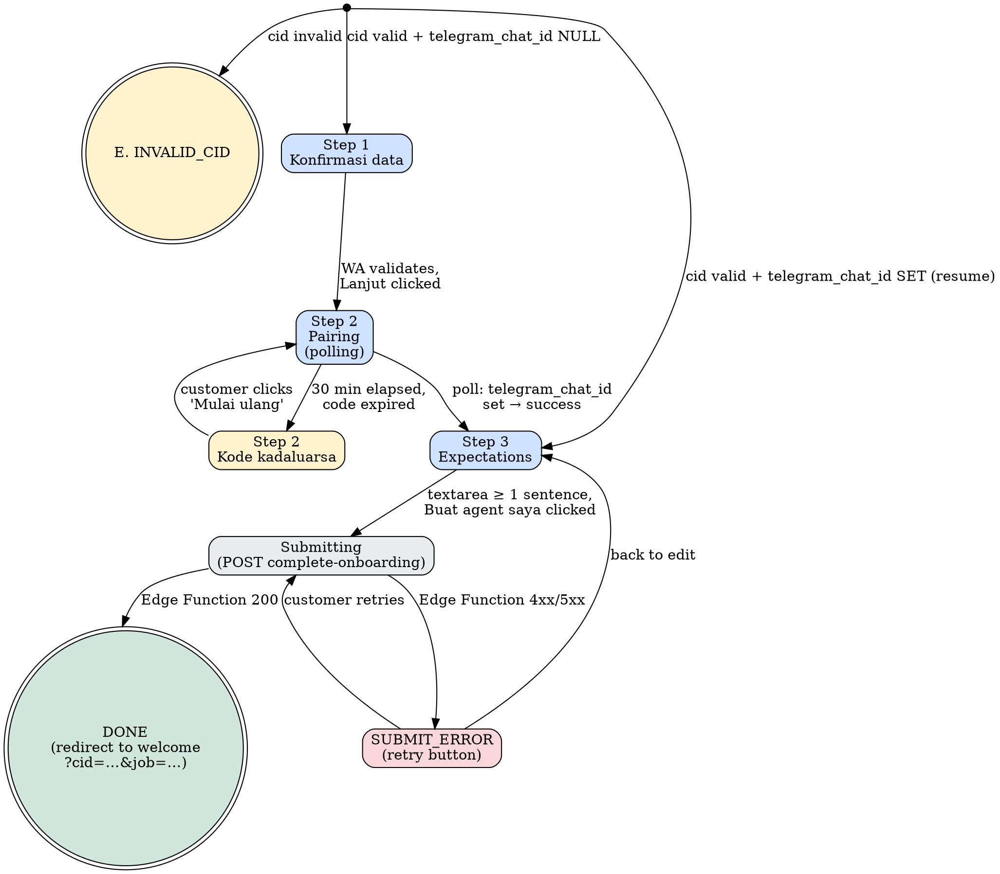

# onboarding.html — Post-Welcome Onboarding Spec (2026-05-06)

> **Status:** APPROVED 2026-05-06 with edits A–H baked in below.
> **Goal:** Capture the three pieces of customer data we cannot derive
> from payment alone, then trigger Hermes provisioning.

## Locked decisions (post-approval, 2026-05-06)

- **3-step flow** confirmed (Konfirmasi data → Pasangkan Telegram →
  Cara kamu pakai agent). No additions, no cuts.
- **Pairing code lifetime: 30 min.** Phase 2B may extend to 60 min if
  expiry-out rate climbs.
- **Polling cadence: 3 seconds** during pairing wait. Phase 2C revisit
  if Supabase load matters — note added to NEXT.md.
- **OpenRouter coupling: decoupled.** Edge Function consumes the
  `ILlmKeyMinter` interface. `MockLlmKeyMinter` returns
  `{ key: 'sk-mock-<uuid>', hash: 'hash-<uuid>' }`. Real minter swaps in
  when Phase 2A merges — env flag `LLM_MINTER_MODE=mock|live`.
- **Test customer:** `TEST_CUSTOMER_TELEGRAM_USER_ID = "9999999999"`
  placeholder. Founder swaps with real 2nd-account ID before integration
  smoke. Founder's primary `6805409051` stays clean.
- **Verbatim copy:** I write it; flag uncertainty during build, founder
  has final cut.

---

## How this fits in the funnel

```
Landing  →  checkout.html  →  Xendit  →  welcome.html  →  onboarding.html  →  welcome.html (status)
                                            (parallel)        (THIS SPEC)         (parallel)

                                            placeholder                          provisioning
                                            CTA:                                 polling shows
                                            "Lengkapi profil                     until status =
                                            agent kamu →"                        active
                                            (target: /onboarding?cid=…)
```

- `welcome.html` is being built in a parallel CC session per
  `docs/plans/2026-05-06-welcome-page-spec.md`. **THIS SPEC DOES NOT TOUCH IT.**
- Their welcome page renders a placeholder CTA `"Lengkapi profil agent kamu →"`
  with `href="#"`. Once both branches merge, that href becomes
  `/onboarding.html?cid=<customer_id>`.
- After onboarding submit succeeds, this page redirects back to
  `/welcome.html?cid=<customer_id>&job=<provisioning_job_id>`. The
  parallel welcome page must accept the optional `?job=` parameter
  for status polling — flagged as a **handoff requirement** below.

---

## URL contract

```
https://weuseai-agent.vercel.app/onboarding.html?cid=<customer_id>
```

- `cid` (required): UUID v4 of the `customers` row, written by `create-invoice`.
- On load: page does ONE Supabase REST fetch to read the customer's
  current state:
  ```
  GET /rest/v1/customers
    ?id=eq.<cid>
    &select=display_name,email,whatsapp_number,
            pairing_code,pairing_code_expires_at,telegram_chat_id
  ```
  If `cid` is missing/invalid/no row → show INVALID_CID state (state E).

- Resume case: if `customer.telegram_chat_id` is already set (returning
  customer mid-flow) → skip Step 2, advance to Step 3 with a small
  "✓ Telegram sudah terhubung" affordance.

---

## File structure

```
weuseai.agent/velorah/
├── checkout.html        ← shipped
├── liren-v3.html        ← shipped (landing)
├── use-cases.html       ← shipped
├── welcome.html         ← parallel session, NOT this spec
└── onboarding.html      ← NEW (this spec)
```

Static HTML at repo root, served by Vercel directly. Same pattern as
welcome.html — Tailwind via CDN, vanilla JS, no build step.

---

## Layout sketch (ASCII — desktop, full flow visible)

### Step 1 — Konfirmasi data

```
┌────────────────────────────────────────────────────────────┐
│                                                             │
│   ●●●○                       (3 dots, dot 1 filled red)     │
│   Step 1 dari 3                                             │
│                                                             │
│   Konfirmasi data kamu.                       (display ser) │
│                                                             │
│   Data ini dipakai buat tagihan + kontak                   │
│   support kalau setup butuh bantuan.                        │
│                                                             │
│   ┌──────────────────────────────────────────────┐         │
│   │ Nama                                          │         │
│   │ ┌──────────────────────────────────────────┐ │         │
│   │ │ Sarah Tanaka                              │ │ readonly│
│   │ └──────────────────────────────────────────┘ │         │
│   │                                                │         │
│   │ Email                                          │         │
│   │ ┌──────────────────────────────────────────┐ │         │
│   │ │ sarah@example.com                         │ │ readonly│
│   │ └──────────────────────────────────────────┘ │         │
│   │                                                │         │
│   │ Nomor WhatsApp                                 │         │
│   │ ┌──────────────────────────────────────────┐ │         │
│   │ │ 0812 3456 7890                            │ │ editable│
│   │ └──────────────────────────────────────────┘ │         │
│   │ Dipakai untuk concierge support, bukan       │         │
│   │ promo. Format: 08xxx atau +62xxx.             │         │
│   └──────────────────────────────────────────────┘         │
│                                                             │
│                              [ Lanjut → ]    (red, w-full)  │
│                                                             │
└────────────────────────────────────────────────────────────┘
```

### Step 2 — Pasangkan Telegram

```
┌────────────────────────────────────────────────────────────┐
│   ●●●○ → ●●●○             (now dot 2 is filled red)         │
│   Step 2 dari 3                                             │
│                                                             │
│   Pasangkan Telegram kamu.                                  │
│                                                             │
│   Agent kamu kirim notifikasi lewat                         │
│   @weuseaibot. Tiga langkah, kira-kira 30 detik.            │
│                                                             │
│   ┌──────────────────────────────────────────────┐         │
│   │  Kode pasangan kamu                            │         │
│   │                                                │         │
│   │       ┌─┐ ┌─┐ ┌─┐  ┌─┐ ┌─┐ ┌─┐                │         │
│   │       │1│ │2│ │3│  │4│ │5│ │6│  display serif  │         │
│   │       └─┘ └─┘ └─┘  └─┘ └─┘ └─┘  big numerals   │         │
│   │                                                │         │
│   │       Kadaluarsa dalam 28:43       (live)      │         │
│   └──────────────────────────────────────────────┘         │
│                                                             │
│   01  Buka Telegram, cari @weuseaibot                       │
│       [ Buka Telegram → ]   (deep-link button, glass)       │
│                                                             │
│   02  Kirim pesan: /pair 123456                             │
│                                                             │
│   03  Tunggu konfirmasi di sini (max 30 detik)              │
│                                                             │
│   ┌──────────────────────────────────────────────┐         │
│   │ ● Menunggu pasangan...      (subtle pulsing)  │         │
│   └──────────────────────────────────────────────┘         │
│                                                             │
│   Belum punya Telegram? Download di telegram.org →          │
│                                                             │
└────────────────────────────────────────────────────────────┘
```

When pairing succeeds, the "Menunggu" box swaps to:
```
   ┌──────────────────────────────────────────────┐
   │ ✓ Pairing berhasil. Lanjut otomatis...        │
   └──────────────────────────────────────────────┘
```
…then auto-advances to Step 3 after 600ms.

### Step 3 — Cara kamu pakai agent

```
┌────────────────────────────────────────────────────────────┐
│   ●●●○ → ●●●○ → ●●●●        (dot 3 filled red)              │
│   Step 3 dari 3                                             │
│                                                             │
│   Cara kamu pakai agent.                                    │
│                                                             │
│   Tulis bebas. Yang kamu tulis di sini jadi                 │
│   "kontrak kepribadian" agent kamu.                         │
│                                                             │
│   ┌──────────────────────────────────────────────┐         │
│   │ Apa yang paling kamu butuhin dari agent kamu? │         │
│   │ ┌──────────────────────────────────────────┐ │         │
│   │ │ Contoh: Bantu briefing pagi, ringkas      │ │  600px  │
│   │ │ berita, follow up klien via WhatsApp.     │ │  6 row  │
│   │ │                                            │ │ textarea│
│   │ │                                            │ │         │
│   │ └──────────────────────────────────────────┘ │         │
│   │                              0 / 600 karakter │         │
│   │                                                │         │
│   │ Atau pilih dari preset:                       │         │
│   │ [Briefing pagi] [Email triage] [Content]      │         │
│   │ [Riset & dokumen] [Trading] [Tugas mahasiswa] │         │
│   └──────────────────────────────────────────────┘         │
│                                                             │
│                  [ Buat agent saya → ]    (red, w-full)     │
│                                                             │
│  Setelah klik, agent kamu mulai dibangun.                   │
│  Proses biasanya 5–7 menit.                                 │
│                                                             │
└────────────────────────────────────────────────────────────┘
```

### Mobile (≤640px)

- Single column, full-width buttons.
- Pairing code display: 6 boxes kept side-by-side (still readable at 28px).
- Preset chips wrap to 2–3 lines.

---

## Final copy (verbatim — every word locked)

### Step 1

| Element | Copy |
|---|---|
| Step indicator | `Step 1 dari 3` |
| Headline | `Konfirmasi data kamu.` |
| Subheadline | `Data ini dipakai buat tagihan + kontak support kalau setup butuh bantuan.` |
| Field label: name | `Nama` |
| Field label: email | `Email` |
| Field label: WA | `Nomor WhatsApp` |
| WA helper | `Dipakai untuk concierge support, bukan promo. Format: 08xxx atau +62xxx.` |
| WA validation error | `Format nomor belum benar. Mulai dengan 08 atau +62.` |
| Primary CTA | `Lanjut →` |
| Footer note (small, muted) | `Butuh ganti nama atau email? WhatsApp tim kami: +62 821-5490-2561` (number is a `https://wa.me/6282154902561` link) |

### Step 2

| Element | Copy |
|---|---|
| Step indicator | `Step 2 dari 3` |
| Headline | `Pasangkan Telegram kamu.` |
| Subheadline | `Agent kamu kirim notifikasi lewat @weuseaibot. Tiga langkah, kira-kira 30 detik.` |
| Code box label | `Kode pasangan kamu` |
| Expiry counter (live, mono, small) | `Kode kadaluarsa dalam: M:SS` — updates every 1s. When ≤ 60s, color shifts to `rgba(229,50,45,0.85)` to signal urgency without being aggressive. |
| Step 01 line | `Buka Telegram, cari @weuseaibot` |
| Step 01 button | `Buka Telegram →` |
| Step 02 line | `Kirim pesan: /pair 123456` (the `123456` is the live code) |
| Step 03 line | `Tunggu konfirmasi di sini (max 30 detik)` |
| Polling state | `Menunggu pasangan...` (with pulsing dot) |
| Success state | `Pairing berhasil. Lanjut otomatis...` (with green ✓) |
| Expired state | `Kode kadaluarsa. Mulai ulang →` (with retry button) |
| Telegram fallback | `Belum punya Telegram? Download di telegram.org →` |

### Step 3

| Element | Copy |
|---|---|
| Step indicator | `Step 3 dari 3` |
| Headline | `Cara kamu pakai agent.` |
| Subheadline | `Tulis bebas. Yang kamu tulis di sini jadi "kontrak kepribadian" agent kamu.` |
| Textarea label | `Apa yang paling kamu butuhin dari agent kamu?` |
| Textarea placeholder | `Contoh: Bantu briefing pagi, ringkas berita, follow up klien via WhatsApp.` |
| Char counter | `N / 600 karakter` |
| Preset section label | `Atau pilih dari preset:` |
| Preset chips (clickable) | `Briefing pagi` · `Email triage` · `Content drafting` · `Riset & dokumen` · `Trading analysis` · `Bantuan tugas` |
| Min-length warning | `Tulis minimal 1 kalimat biar agent ngerti karakter kamu.` |
| Submit button — disabled (< 10 chars typed) | `Lengkapi cara pakai agent` (greyed, not clickable) |
| Submit button — active (≥ 10 chars typed) | `Buat agent saya →` (red, glowing) |
| Below CTA, italic muted | `Setelah klik, agent kamu mulai dibangun. Proses biasanya 5–7 menit.` |

### Submit-state copy (between click and redirect, ~1–2 seconds)

| Element | Copy |
|---|---|
| Loading | `Menyiapkan agent kamu...` |
| Error: pairing not complete | `Telegram belum terpasang. Kembali ke step 2 →` |
| Error: server | `Ada kendala teknis. Coba lagi dalam 1 menit, atau hubungi tim via WhatsApp.` |
| Error: server (with WA button) | button `Hubungi tim →` linking to `https://wa.me/6282154902561` |

### Edge state copy (state E — invalid cid)

| Element | Copy |
|---|---|
| Headline | `Halaman ini hanya untuk pelanggan yang sudah bayar.` |
| Subline | `Mungkin kamu salah link? Kembali ke beranda.` |
| CTA | `Kembali ke beranda →` (links to `/`) |

---

## State diagram



**Polling cadence:** every **3 seconds** while in S2. Stop when
`telegram_chat_id` is populated, or after 30 min (code expiry).

**Resume rules:**
- Customer reloads the page mid-flow → re-fetch customer state, jump
  to the correct step. Pairing code is regenerated only if the previous
  one expired (otherwise the same code keeps showing — important for
  customers switching tabs).

---

## Backend additions

### 1. Schema migration

File: `supabase/migrations/<ts>_onboarding.sql`

```sql
-- Onboarding flow additions.
--   - 6-digit pairing code linking onboarding page to @weuseaibot's
--     /pair handler. Lifetime: 30 minutes. Single-use (cleared on success).
--   - SOUL.md persona text (rendered + stored verbatim, also written to
--     ~/.hermes/SOUL.md on the customer's VPS during provisioning).
--   - Audit log of SOUL.md hashes for byte-level "did this customer get
--     the right persona" debugging without storing PII twice.
--   - Anon SELECT policy on customers (narrow scope per RLS note below).

alter table customers
  add column if not exists pairing_code text,
  add column if not exists pairing_code_expires_at timestamptz,
  add column if not exists soul_md_text text;

create unique index if not exists customers_pairing_code_active_idx
  on customers(pairing_code)
  where pairing_code is not null;

create table if not exists customer_persona_audit (
  id bigserial primary key,
  customer_id uuid not null references customers(id) on delete cascade,
  soul_md_sha256 text not null,        -- hex, 64 chars
  generated_at timestamptz default now()
);

create index if not exists customer_persona_audit_customer_idx
  on customer_persona_audit(customer_id, generated_at desc);

-- RLS: anon needs a narrow SELECT to read its own onboarding state from
-- the page. Service-role-only writes (no INSERT/UPDATE policy for anon).
create policy if not exists "anon can read own customer onboarding state"
  on customers for select
  to anon
  using (true);  -- Phase 1: anyone-with-the-uuid. Tighten in Phase 2B.
```

**Risk note:** the SELECT policy exposes `display_name`, `email`,
`whatsapp_number` to anyone with the UUID. UUIDs are unguessable, but
to be safe the page only fetches the fields it needs and never echoes
them back into the URL. Phase 2B should swap UUIDs for short-lived
signed tokens (same plan as welcome.html).

### 2. New Edge Function: `complete-onboarding`

`supabase/functions/complete-onboarding/index.ts` (entry) +
`supabase/functions/_shared/complete-onboarding-handler.ts` (pure
handler, Node-testable).

**Endpoint:** `POST /functions/v1/complete-onboarding`

**Body:**
```ts
{
  customer_id: string,        // uuid
  whatsapp: string,           // 08xxx or +62xxx, validated server-side too
  expectations_text: string,  // 1+ sentences, max 600 chars
}
```

**Response (200):**
```ts
{
  provisioning_job_id: string,  // uuid
  redirect_url: string,         // absolute, points to welcome page
}
```

**Response (4xx / 5xx):** `{ error: string }`

**Server-side flow:**
1. Validate `customer_id` — exists, has at least one subscription where
   `status` ∈ (`active`, `pending_provision`).
2. **Idempotency check** (edit G): if customer already has
   `telegram_chat_id IS NOT NULL` AND `soul_md_text IS NOT NULL` AND
   subscription `status = 'active'` → return **409**
   `{ error: "already_onboarded", redirect: "<PUBLIC_BASE>/welcome.html?cid=<cid>" }`.
   Prevents double-mint + double-spin-up if the customer double-clicks
   submit or refreshes the network tab.
3. Re-fetch the customer row. Confirm `telegram_chat_id IS NOT NULL`
   (pairing is the precondition — onboarding submit can't bypass it).
4. Update `customers`:
   - `whatsapp_number = whatsapp`
   - `display_name` is already prefilled (no overwrite)
   - Clear `pairing_code` + `pairing_code_expires_at`
5. **Render SOUL.md** from the locked scaffold (see "SOUL.md
   generation" section below). Validate, hash, store
   `customers.soul_md_text` and append a row to
   `customer_persona_audit` (sha256 + timestamp + customer_id).
6. Mint LLM key via the injected `ILlmKeyMinter` (mock in dev, real
   OpenRouter once Phase 2A merges):
   - `name = customer_id`
   - `limitUsdCents` from tier:
     - `starter` → 300 ($3)
     - `pro` → 500 ($5)
     - `studio` → 3000 ($30)
7. Insert into `customer_openrouter_keys` (table from Phase 2A
   migration — required prerequisite).
8. POST to `${PROVISIONING_URL}/spin-up` with bearer
   `PROVISIONING_AUTH_TOKEN`:
   ```ts
   {
     customerId: string,
     tier: 'starter' | 'pro' | 'studio',
     telegramChatId: string,        // numeric, from customers row
     openrouterApiKey: string,      // secret minted in step 6
     soulMdContent: string,         // rendered in step 5
     alwaysOnEnabled: boolean,      // from subscriptions row
   }
   ```
   Returns `{ jobId: string }` on 200.
9. **Rollback on partial failure:** if step 8 returns non-2xx, call
   `minter.revoke(hash)` to free the minted key, set the subscription
   to `pending_provision` (existing webhook retry worker picks it up).
   Do NOT clear `pairing_code` or `telegram_chat_id` — those are still
   valid. Do NOT clear `soul_md_text` — same persona for the retry.
10. Update subscription `status = 'active'` and `hosting_active = true`
    only after the provisioning service returns 200 (it owns "VPS
    exists & Hermes installed"; webhook handler owns "billing started").
11. Return `{ provisioning_job_id: jobId, redirect_url: '<PUBLIC_BASE>/welcome.html?cid=<cid>&job=<jobId>' }`.

#### SOUL.md generation (edit H — locked scaffold)

The scaffold is **content territory** owned by the founder. Stored in
`supabase/functions/_shared/soul-md-template.ts` as a single template
literal. Renderer applies these substitutions:

| Variable | Source |
|---|---|
| `{customer_name}` | `customers.display_name` (full string) |
| `{first_name}` | First whitespace-delimited token of `display_name`. If the token is ≤ 2 chars OR ends in `.` (e.g. `M.`), fall back to `customers.display_name` (full name) for the greeting line. |
| `{user_expectations_verbatim}` | `expectations_text` from request, after sanitizer (rule 1 below) |
| `{connected_apps_list}` | Phase 1: hard-coded string `Telegram (chat dengan @weuseaibot)`. Phase 2C extends to a real list. |

**Generation rules in the handler (locked):**

1. **Sanitize `user_expectations_verbatim`:**
   - Strip C0 control chars (`/[\x00-\x08\x0B\x0C\x0E-\x1F\x7F]/g`).
     Allow `\n` (LF, `\x0A`) and `\t` (TAB, `\x09`).
   - **Reject** input containing `</SOUL>`, `</persona>`,
     `# Hard limits`, `# Connected tools`, `# When my customer first messages me`,
     or markdown fences trying to break out (`````). Return
     **400** `{ error: "invalid_input", reason: "template_injection_attempt" }`.
   - These are obvious injection vectors; aim is "good-faith customers
     pass, scripted attacks fail". Not a perfect security boundary —
     defense in depth comes from the LLM ignoring such instructions
     downstream too.
2. **Trim** leading/trailing whitespace.
3. **First-name extraction** — see table above; ambiguous → fall back
   to full `display_name`.
4. **UTF-8 encode** — Indonesian names with diacritics (Andrés, Putri,
   M. Hilmán) must round-trip cleanly. We use TextEncoder when hashing.
5. **Save** to `customers.soul_md_text` (full rendered markdown), AND
   pass via `spin-up` payload as `soulMdContent`. Provisioning writes
   it to `~/.hermes/SOUL.md` on the customer's VPS.
6. **Audit** — compute `sha256(soul_md_text)` (hex), insert into
   `customer_persona_audit (customer_id, soul_md_sha256, generated_at)`.
   No raw SOUL.md content in audit — only the hash. Lets us later say
   "did this customer's agent get the right persona, byte-for-byte"
   without storing PII twice.

**Locked scaffold (verbatim — written into SOUL.md after substitution):**

```md
# About me

I am an AI agent built for {customer_name}, a customer of weuseai.agent.
I work in their service, on their VPS, with their data. I am theirs.

# How I communicate

Language: Bahasa Indonesia (default). Switch to English only if the user writes in English first.
Tone: casual but respectful. Use "kamu" — never "lo/gue", never "Anda".
Style: concise and direct. Indonesian customers value short answers over long preambles.

# Who I serve

Name: {customer_name}
Time zone: Asia/Jakarta (WIB, UTC+7) unless the customer indicates otherwise.

# What this customer expects from me

{user_expectations_verbatim}

# How I behave

- Refer to the customer by name when natural ("Pagi, {first_name}.").
- When uncertain, ask one clarifying question rather than guessing.
- Surface progress proactively. If a task takes more than 30 seconds, give a status update.
- Decline tasks that violate my hard limits below — politely, with a brief explanation.

# Hard limits

- Never share API keys, passwords, or customer data with third parties.
- Never make purchases or commit money on the customer's behalf without explicit in-session confirmation.
- Never invent facts. If I don't know something, I say so.
- Never impersonate the customer in messages they did not approve.

# Connected tools

{connected_apps_list}

# When my customer first messages me

If this is our first interaction (no prior conversation with this user):
- Greet warmly using their name.
- Briefly remind them what I can help with — pick 3 examples that fit their stated expectations above.
- Ask how I can help today.
```

**Phase 2C roadmap (per founder, do not build now):**
- Customer dashboard allows editing SOUL.md sections except `# Hard limits` (locked by us).
- `{connected_apps_list}` expands as customer adds integrations.
- Drift detection: if customer keeps correcting the agent the same way,
  surface "want us to update your SOUL.md?" via WhatsApp tim.

**Error map:**
| Code | Body | When | Customer-facing copy |
|---|---|---|---|
| 400 | `{ error: "invalid_input", reason: "template_injection_attempt" }` | sanitizer rejects expectations_text | "Ada karakter yang ditolak. Tulis ulang tanpa tag/kode." |
| 400 | `{ error: "missing_field", field: "..." }` | required field missing | (UI prevents — fallback message) |
| 404 | `{ error: "no_paid_subscription" }` | `customer_id` doesn't match a paid sub | (page doesn't reach here — UI loads via cid first) |
| 409 | `{ error: "telegram_not_paired" }` | `telegram_chat_id` NULL | "Telegram belum terpasang. Kembali ke step 2 →" |
| 409 | `{ error: "already_onboarded", redirect: "/welcome.html?cid=..." }` | edit G — already onboarded | UI auto-follows `redirect` (no error toast needed) |
| 422 | `{ error: "expectations_too_short" \| "expectations_too_long" }` | length out of bounds | "Tulis minimal 1 kalimat..." / "Maksimum 600 karakter." |
| 502 | `{ error: "llm_mint_failed" }` | minter threw | "Ada kendala teknis. Coba lagi dalam 1 menit." |
| 503 | `{ error: "provisioning_unreachable" }` | provisioning POST failed | "Ada kendala teknis. Coba lagi dalam 1 menit." (rollback applied) |
| 500 | `{ error: "internal" }` | unhandled | "Ada kendala teknis. Coba lagi dalam 1 menit." |

### 3. New Edge Function: `telegram-bot-webhook`

`supabase/functions/telegram-bot-webhook/index.ts` (entry) +
`supabase/functions/_shared/telegram-bot-webhook-handler.ts` (pure handler).

**Endpoint:** `POST /functions/v1/telegram-bot-webhook` (secret-token
verified via `X-Telegram-Bot-Api-Secret-Token` header — set during
`setWebhook` call).

**Body:** standard Telegram `Update` object — see [Bot API docs].

**Handler logic:**
```ts
// Only handle text messages with command "/pair <6-digit-code>"
if (!update.message?.text) return ok(); // ignore non-text
const m = update.message.text.match(/^\/pair\s+(\d{6})$/);
if (!m) {
  await replyText(
    update.message.chat.id,
    'Kirim "/pair 123456" dengan 6 digit kode pasangan dari halaman onboarding.'
  );
  return ok();
}
const code = m[1];
const customer = await db.findCustomerByPairingCode(code);
if (!customer || customer.pairing_code_expires_at < now()) {
  await replyText(
    update.message.chat.id,
    'Kode tidak valid atau kadaluarsa. Cek halaman onboarding kamu.'
  );
  return ok();
}
await db.updateCustomer(customer.id, {
  telegram_chat_id: String(update.message.chat.id),
  pairing_code: null,
  pairing_code_expires_at: null,
});
await replyText(
  update.message.chat.id,
  'Pairing berhasil. Agent kamu sedang dibangun — pesan halo akan masuk dalam 5-7 menit.'
);
return ok();
```

**Tone:** trimmed to one sentence per founder edit A. No exclamation;
calm-premium register matches the rest of the brand voice.

**Webhook config (one-time):**
```bash
curl -X POST "https://api.telegram.org/bot<TOKEN>/setWebhook" \
  -d "url=https://<project>.supabase.co/functions/v1/telegram-bot-webhook" \
  -d "secret_token=<random>" \
  -d "allowed_updates=[\"message\"]"
```
The `secret_token` must match the `TELEGRAM_WEBHOOK_SECRET` env var
on the Edge Function.

**Verification curl** (you can run after deploy):
```bash
curl "https://api.telegram.org/bot<TOKEN>/getWebhookInfo"
# Expect: { "ok": true, "result": { "url": "https://....supabase.co/...", "has_custom_certificate": false, "pending_update_count": 0 } }
```

### 4. Pairing code generator

A small helper in the onboarding page itself (NOT an Edge Function —
fewer round-trips, less code to deploy). On page load, if
`customer.pairing_code IS NULL OR pairing_code_expires_at < now()`:

```ts
async function rotatePairingCode(customerId: string): Promise<void> {
  const code = String(crypto.getRandomValues(new Uint32Array(1))[0] % 1_000_000)
    .padStart(6, '0');
  const expiresAt = new Date(Date.now() + 30 * 60 * 1000).toISOString();

  // PATCH /rest/v1/customers?id=eq.<cid>
  await supabasePatch('customers', customerId, {
    pairing_code: code,
    pairing_code_expires_at: expiresAt,
  });
}
```

Collision risk: 1 in 1M per active code, plus the unique partial
index in the migration enforces no two active codes collide. If a
collision happens (race), the second update fails with 409 — UI
catches it, generates a new code, retries once. Not exposed to user.

---

## Tech stack confirmation

Same as welcome.html.

| Concern | Choice | Notes |
|---|---|---|
| Markup | Static HTML at repo root | Matches existing pattern |
| Styling | Tailwind via CDN + inline `<style>` | Reuse same CSS tokens (`--accent: #E5322D`) as checkout.html |
| JS | Vanilla `<script>` | No React/Babel — page is form + polling + a few state transitions, doesn't justify the kilobytes |
| Polling | `fetch()` against Supabase REST | Same anon key already in checkout.html |
| Auth on poll | Supabase **anon** key | Works once `customers` SELECT RLS policy lands |
| Brand | Dark + red halftone (matches checkout.html re-skin) | Subtle red dot strip at top of card stack |
| Fonts | `Inter` body, `Instrument Serif` display | Same as welcome.html |
| Animations | CSS transitions + a CSS-only pulsing dot | No Framer Motion |
| Mobile-first | Yes, single column | Buyer cohort is mobile-heavy |

---

## Voice + brand audit

| Banned word | Used in spec? |
|---|---|
| `basically`, `just`, `literally`, `honestly`, `kind of`, `pretty much`, `revolutionary`, `disrupt`, `10x`, `game-changer`, `next-level` | ✅ NONE |
| `Anda` | ✅ NONE |
| `lo / gue / aku` | ✅ NONE (only `kamu`) |
| Emoji in customer copy | ✅ ZERO (✓ on success state is a typographic glyph, consistent with vs-chat + welcome) |
| Exclamation marks in body copy | ✅ ZERO in page copy. ONE permitted in bot reply per founder spec ("Pairing berhasil!") |

**Tone test:** every sentence is observational + calm. The flow walks
the buyer through a sequence; it doesn't celebrate or hype. Reads
like a quiet utility, which is what someone Rp 1,29jt deep wants.

---

## TDD plan (mirror Phase 1 / 2A discipline)

Tests in `tests/` at repo root (consistent with `tests/end-to-end-mock.spec.ts`).

### Unit / handler tests

`tests/complete-onboarding-handler.spec.ts`
- ✅ happy path: valid customer → mints key → calls provisioning → returns job_id + redirect
- ✅ rejects when telegram_chat_id is NULL → 409
- ✅ rejects when expectations_text empty → 422
- ✅ rejects when expectations_text > 600 chars → 422
- ✅ rejects when customer_id has no paid subscription → 404
- ✅ rolls back OpenRouter key when provisioning POST fails
- ✅ does not double-mint if called twice for same customer (idempotency
  via existence check on `customer_openrouter_keys`)

`tests/telegram-bot-webhook-handler.spec.ts`
- ✅ /pair with valid code sets telegram_chat_id, clears code, replies success
- ✅ /pair with expired code does not update DB, replies "kadaluarsa"
- ✅ /pair with bad-format code (e.g. "/pair abc") replies usage hint
- ✅ non-/pair messages are silently ignored (return 200 OK)
- ✅ webhook signature mismatch returns 401 (entry-level test only)

`tests/pairing-code-rotation.spec.ts`
- ✅ generates 6-digit codes
- ✅ never collides with existing active code (mock unique constraint)
- ✅ regenerates if existing code is expired

### Integration test

`tests/onboarding-flow.spec.ts` (mocked Telegram + OpenRouter + provisioning)
- Walks the full flow: stub customer → fetch state → POST to telegram-bot-webhook /pair → verify chat_id set → POST to complete-onboarding → verify SOUL.md content + provisioning payload + redirect_url

### Manual smoke (from CLAUDE.md verification checklist)

- Apply migration: `supabase db push`
- Set webhook: curl `setWebhook` (founder runs this — needs the bot token)
- Fire `create-invoice` with stub customer to get a `cid`
- Open `/onboarding.html?cid=<that>` in mobile + desktop
- Run through all 3 steps end-to-end
- Confirm Telegram bot DM works for `/pair <code>`
- Confirm welcome.html receives `?cid=…&job=…` and starts polling
- Verify in DB: `customers.telegram_chat_id`, `whatsapp_number`,
  `customer_openrouter_keys` row created, subscription `status=active`

**Stub customer for testing** (per founder direction):
- Insert one test customer in Supabase manually OR via a small script
- email: `e2e-test-2026-05-06@weuseai.example` (clearly throwaway)
- display_name: `E2E Test`
- Use a SECOND Telegram account (NOT founder's `6805409051`) to send
  /pair messages — Founder's chat stays clean.
- Founder confirms which test Telegram account they'll use, OR I
  bring a throwaway second account.

---

## Out of scope (deferred)

- BYOK LLM keys (Pro/Studio paste OpenAI / DeepSeek / etc.) → **Phase 3**.
  For now, all tiers use minted OpenRouter keys per Phase 2A. Founder's
  hint: "Punya API key sendiri? Hubungi tim untuk dapat diskon 30%"
  with WhatsApp link — but **not building the BYOK form now**, just a
  link in the WhatsApp footer of welcome.html (parallel session owns).
- WhatsApp pairing (parallel to Telegram) → **Phase 2B**. The
  WA number we collect now is only used for support / concierge,
  not as an agent channel.
- "Send test message to your bot now" CTA after provisioning succeeds
  → **Phase 2B** (lives on welcome.html if needed).
- I18n / English version → Phase 3.
- Customer-controlled regeneration of pairing code from inside Telegram
  (e.g. "/regenerate") → Phase 3 if customers ask.

---

## Coordination handoffs

### With welcome.html parallel session

| What | Action | Owner |
|---|---|---|
| Welcome page CTA target | `href="/onboarding.html?cid={cid}"` | parallel session |
| Welcome accepts `?job=<id>` param | Extend their polling logic to use job_id when present, else fall back to subscriptions table query | **parallel session — flag as REQUIREMENT** |
| Submit redirect from onboarding → welcome | `redirect_url = "<PUBLIC_BASE>/welcome.html?cid=<cid>&job=<jobId>"` | this spec |
| WhatsApp number in welcome footer | Both pages should use the same `+62 821-5490-2561` | both |

I'll write a 1-paragraph note for the welcome session in
`docs/plans/2026-05-06-onboarding-page-spec.md` (this file)
under the "Handoff" header — the parallel session's owner will read this.

### With Phase 2A worktree merge — DECOUPLED

Per founder direction (post-approval), Phase 1 onboarding does **not**
gate on Phase 2A. The Edge Function consumes an `ILlmKeyMinter`
interface defined in `supabase/functions/_shared/llm-key-minter.ts`
(matches the contract from `.worktrees/phase1-provisioning/services/provisioning/src/llm/llm-key-minter.ts`).

Two implementations:
- `MockLlmKeyMinter` — returns `{ key: 'sk-mock-<uuid>', hash: 'hash-<uuid>' }`
  and a no-op `revoke()`. Suitable for end-to-end smoke against a stub
  customer. Default in dev.
- `OpenRouterKeyMinter` — Deno-compatible mirror of the Phase 2A Node
  class. Lives in `supabase/functions/_shared/openrouter-key-minter.ts`
  in this branch. When Phase 2A merges, the Node version stays in
  `services/provisioning/` for the provisioning service; this Deno
  version stays in `supabase/functions/_shared/` for the Edge Function.
  Shared interface, separate runtime targets.

Selection at runtime:
```ts
// supabase/functions/complete-onboarding/index.ts
const minter: ILlmKeyMinter =
  Deno.env.get('LLM_MINTER_MODE') === 'live'
    ? new OpenRouterKeyMinter({ provisioningKey: Deno.env.get('OPENROUTER_PROVISIONING_KEY')! })
    : new MockLlmKeyMinter();
```

Rollout sequence:
1. Ship onboarding with `LLM_MINTER_MODE=mock` (default) — full E2E
   smoke runs against the stub customer with mock keys.
2. When Phase 2A migration merges and `OPENROUTER_PROVISIONING_KEY`
   is set, flip the env var to `live`. No code change.
3. First real-money paying customer triggers a real OpenRouter mint.
   Verify in OpenRouter dashboard: a key named `<customer_id>` exists
   with the tier-correct credit limit.

**Required prerequisite for `live`:** Phase 2A migration
`20260504210000_phase2a_openrouter_keys.sql` (the
`customer_openrouter_keys` table) must be applied. Edge Function step
7 inserts into that table; without it the insert errors and triggers
rollback. We can document this in the runbook for the env-flag flip.

### Existing landing prices vs checkout.html (price sync task)

This is a separate sub-task included in scope per founder direction.
After this spec is approved I'll:
1. Audit `checkout.html` for hardcoded `Rp 299.000` / `Rp 1.200.000` /
   `Rp 4.900.000` and update to `Rp 399.000` / `Rp 1.290.000` /
   `Rp 5.900.000`.
2. Update `supabase/functions/_shared/pricing.ts` to match (server-side
   `amount_idr` validation).
3. Cross-check with `services/payment/` IPaymentProvider stubs.
4. Commit as a separate `[checkout][pricing]` commit so the diff is
   reviewable.

The landing already has new prices (per commit 827ba52 noted by founder
— I'll verify alignment before pushing the sync).

---

## Performance budget

Target: Lighthouse Performance ≥ 90 on mobile.

- Page weight: < 80 KB (more than welcome.html because of form + polling
  but no images/framework still)
- First Contentful Paint: < 1.5s
- Largest Contentful Paint: < 2.5s
- Total Blocking Time: < 200ms
- No layout shifts during step transitions (each step reserves the
  same vertical envelope; transitions are opacity + translateY only)

---

## Approval gate

**Before I write any code:**

1. ⏳ Founder reads this spec end-to-end
2. ⏳ Founder confirms:
   - 3-step flow as described (or asks to add/cut a step)
   - Final copy in the verbatim table is correct (any edits?)
   - Pairing code lifetime: 30 minutes (or different?)
   - Polling cadence: 3 seconds during pairing wait (or different?)
   - Bot reply copy "Pairing berhasil! Tunggu agent kamu siap dalam
     5-7 menit. Kamu akan dapat pesan halo dari agent kamu." (any edits?)
   - Stub test customer arrangement (founder brings 2nd Telegram OR
     I find one)
3. ⏳ Founder confirms `OPENROUTER_PROVISIONING_KEY` is set on
   Supabase Edge Functions OR explicitly defers to wait for Phase 2A
   merge

**After approval:**

1. Branch off `feat/landing-vs-comparison` (or fresh branch off main —
   founder's call) as `feat/onboarding-flow`.
2. Build in this order to keep tests green at every step:
   - **Day 1.** Migration + handler tests (no UI yet)
     - `supabase/migrations/<ts>_pairing_code.sql`
     - `supabase/functions/_shared/complete-onboarding-handler.ts`
       + tests
     - `supabase/functions/_shared/telegram-bot-webhook-handler.ts`
       + tests
   - **Day 2.** Edge Function entries + deploy to Supabase
     - `supabase/functions/complete-onboarding/index.ts`
     - `supabase/functions/telegram-bot-webhook/index.ts`
     - `supabase functions deploy ...`
     - Set Telegram webhook (founder runs the curl)
   - **Day 3.** UI
     - `onboarding.html` (all 3 steps + state machine + polling)
     - `assets/onboarding.css` if needed (likely inlined)
   - **Day 4.** Integration test + smoke
     - Run full flow against staging Supabase
     - Send screenshots to founder
   - **Day 5.** Price sync (`checkout.html` + `pricing.ts`)
     - Separate commit, separate review.
3. Push branch → Vercel preview → send URL + screenshots for review.
4. After approval: coordinate merge with welcome.html branch and
   `feat/landing-vs-comparison` (3 branches need to land in order:
   landing-overhaul → welcome-page → onboarding-flow, or merged simul-
   taneously if non-overlapping).

---

## Sign-off

Awaiting founder approval. Reply with:
- `approve` (build as spec'd)
- `approve + edits: <list>` (build with these adjustments)
- `revise` + open questions

**Time-to-ship after approval:** ~5 days of focused work (handler
tests Day 1, Edge Functions Day 2, UI Day 3, integration Day 4, price
sync Day 5).

---

## Handoff note for welcome.html parallel session

> Hi parallel session — when your `welcome.html` ships, please make
> sure it can read both:
>
> - `?cid=<customer_id>` (existing — your spec)
> - `?cid=<customer_id>&job=<provisioning_job_id>` (new — added by
>   onboarding.html submit redirect)
>
> When `?job=` is present, prefer polling status by job_id (more
> direct than re-deriving from subscriptions table). If you want a
> shared polling endpoint I can add `GET /functions/v1/provisioning-status?job=<id>`
> in the same Edge Function deployment — let me know.
>
> Also: WhatsApp number for footer is **+62 821-5490-2561**, deep-link
> **https://wa.me/6282154902561** (per founder).
>
> The placeholder CTA `"Lengkapi profil agent kamu →"` should land at
> `/onboarding.html?cid=<cid>` (not `#`).
