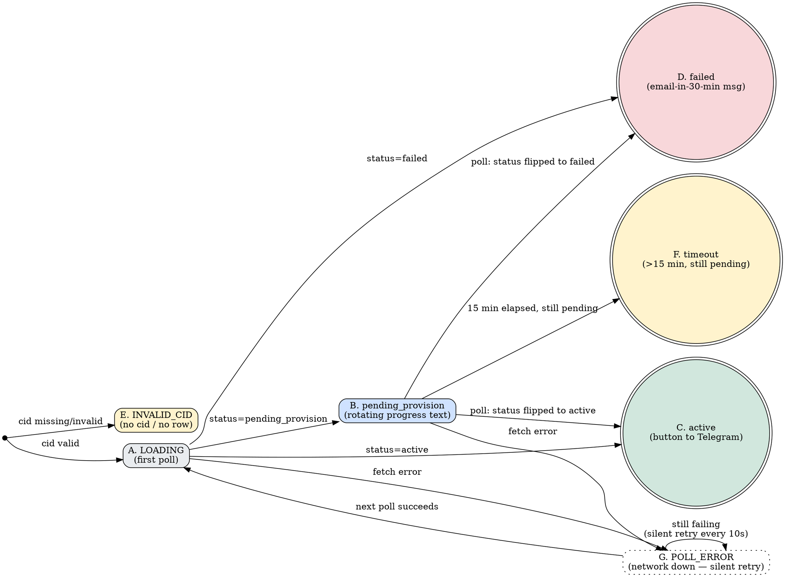

# welcome.html — Post-Payment Landing Spec (2026-05-06)

> **Status:** SPEC FOR REVIEW. Do NOT build until founder approves.
> **Goal:** Replace the Vercel 404 customers currently hit after Xendit payment.

---

## Why this exists

`supabase/functions/create-invoice/index.ts:149` sets:
```
successRedirectBase: `${PUBLIC_BASE}/welcome`
```

After successful Xendit payment the customer is redirected to
`https://weuseai-agent.vercel.app/welcome?cid=<customer_id>` — and currently
gets a 404. This is the most visible gap blocking real paying customers.

---

## File structure

```
weuseai.agent/velorah/
├── checkout.html         ← already shipped
├── liren-v3.html         ← already shipped (landing)
├── use-cases.html        ← already shipped
└── welcome.html          ← NEW (this spec)
```

Static HTML at the repo root, served directly by Vercel (matches existing
pattern). No framework, no build step.

---

## URL contract

```
https://weuseai-agent.vercel.app/welcome?cid=<customer_id>
```

- `cid` (required): UUID v4 of the customer row in Supabase.
  Used to poll `subscriptions` table to discover provision status.

**Edge case** — if `cid` is missing, malformed, or doesn't match any row:
show the "wrong link" message (see State E below). NEVER expose customer
email, name, or any PII via URL.

---

## Layout sketch (ASCII)

```
┌──────────────────────────────────────────────────┐
│                                                   │
│            ●  Pembayaran berhasil                 │  ← pill, signal red border
│                                                   │
│      Selamat datang.                              │  ← display serif H1
│      Agent kamu sedang dibangun.                  │
│                                                   │
│      Dalam 5–7 menit, satu pesan akan masuk      │  ← calm subtext
│      ke Telegram kamu — tanda agent siap         │
│      bekerja.                                     │
│                                                   │
├──────────────────────────────────────────────────┤
│                                                   │
│  ┌────────────────────────────────────────────┐  │
│  │ ● VPS sedang disiapkan...                 │  │  ← STATUS BOX
│  │                                            │  │     (live polling,
│  │   ▓▓▓▓▓▓▓▓░░░░░░░░░░░░░░░  ~2 menit lagi │  │      sub-card)
│  │                                            │  │
│  └────────────────────────────────────────────┘  │
│                                                   │
├──────────────────────────────────────────────────┤
│                                                   │
│  Yang akan terjadi:                               │
│                                                   │
│   01  Buka Telegram, cari @weuseaibot            │  ← steps
│       [Buka Telegram →]                           │     numbered
│                                                   │
│   02  Klik /start untuk memperkenalkan diri      │
│                                                   │
│   03  Tunggu pesan halo dari agent kamu          │
│                                                   │
│  Pertama kali pakai? Tim kami akan menghubungi   │  ← concierge note,
│  kamu via email kalau butuh bantuan setup.       │     italic, muted
│                                                   │
├──────────────────────────────────────────────────┤
│                                                   │
│  Butuh bantuan? WhatsApp tim kami: +62 xxx-xxx   │  ← footer
│  FAQ  ·  weuseai.agent                            │
│                                                   │
└──────────────────────────────────────────────────┘
```

Mobile (single column): everything stacks vertically, full-width status box,
buttons full-width, footer wraps.

---

## Final copy (verbatim — every word locked)

### Hero

**Pill label:** `Pembayaran berhasil`

**Headline (display serif):**
```
Selamat datang.
Agent kamu sedang dibangun.
```

**Subheadline:**
```
Dalam 5–7 menit, satu pesan akan masuk ke Telegram kamu —
tanda agent siap bekerja.
```

### Status box — copy per state

See "State diagram" section below for transitions.

| State | Headline | Subline / detail |
|-------|----------|------------------|
| **A. LOADING** (initial poll in-flight) | `Memeriksa status...` | (subtle pulsing dot, no progress bar) |
| **B. pending_provision** | rotating: `VPS sedang disiapkan...` → `Hermes sedang dipasang...` → `Skill kamu di-tune...` | progress bar at ~indeterminate, "estimasi 5–7 menit total" |
| **C. active** | `✓ Agent kamu siap. Cek Telegram.` | button `Buka Telegram →` (deep-link) |
| **D. failed** | `Ada kendala teknis.` | `Tim kami sudah menerima notifikasi dan akan menghubungi via email dalam 30 menit.` |
| **E. INVALID_CID** | `Halaman ini hanya untuk konfirmasi pembayaran.` | `Mungkin kamu salah link? Kembali ke beranda.` + button to `/` |
| **F. timeout** (>15 min still pending_provision) | `Provisioning butuh waktu lebih lama dari biasanya.` | `Tim kami sudah dapat notifikasi. Kamu akan dihubungi via email dalam 30 menit.` |
| **G. POLL_ERROR** | (no state change, subtle indicator) | small text bottom of card: `Memeriksa...` (rotating dots), retry every 10s silently |

### Steps section

**Header:** `Yang akan terjadi:`

**Step 01:**
- Title: `Buka Telegram, cari @weuseaibot`
- Action button: `Buka Telegram →`
- Behavior: deep-link `tg://resolve?domain=weuseaibot` with HTTPS fallback
  `https://t.me/weuseaibot` for desktop browsers

**Step 02:**
- Title: `Klik /start untuk memperkenalkan diri`
- No button — just the instruction

**Step 03:**
- Title: `Tunggu pesan halo dari agent kamu`
- No button — just the instruction

### Concierge note

```
Pertama kali pakai? Tim kami akan menghubungi kamu via email
kalau butuh bantuan setup.
```

(small italic, muted text below the steps)

### Footer

```
Butuh bantuan? WhatsApp tim kami: +62 xxx-xxx-xxx    [link]
FAQ                                                   [link → /#faq]
weuseai.agent                                         [logo, links to /]
```

**⚠️ Open question for founder:** WhatsApp number to put in footer.
- Option A: hardcode founder's number
- Option B: placeholder `+62 xxx-xxx-xxx` and resolve before merge
- Option C: link to a WhatsApp deep-link `https://wa.me/<number>`

Will use placeholder until founder confirms.

---

## State diagram for status box



**Terminal states** (double-circle): C (active), D (failed), F (timeout).
Polling stops once any terminal state is reached.

**Polling cadence:** every **10 seconds** while in B or G. Stop when in C, D,
F, or E.

---

## Tech stack confirmation

| Concern | Choice | Rationale |
|---|---|---|
| Markup | Static HTML at repo root | Matches `liren-v3.html` / `checkout.html` pattern |
| Styling | Tailwind via CDN + small inline `<style>` block | Matches existing pattern, zero build step |
| JS | Vanilla `<script>` (no React/Babel) | Page is dead-simple — polling + DOM updates only. React-via-CDN would be overkill and slower to first paint. |
| Polling | `fetch()` against Supabase REST | `GET /rest/v1/subscriptions?id=eq.<sub-from-cid>&select=status` — but see security note below |
| Auth on poll | Supabase **anon** key | Public-by-design key; needs RLS policy on `subscriptions` table |
| Brand colors | Signal Red `#E5322D`, dark `bg-black` (matches landing) | Per existing pages — CLAUDE.md mentions Bone/Liren Blue but actual landing uses dark theme |
| Fonts | `Inter` (body), `Instrument Serif` (display) — already loaded by landing | Reuse to avoid extra font fetch |
| Animations | CSS transitions only (no Framer Motion) | Page is one-shot, no interactivity beyond polling |
| Mobile-first | Yes, single-column layout | Indonesian customer base is mobile-heavy |

---

## ⚠️ Security note (must address before launch)

The polling URL contains the **customer UUID** in plain text. Anyone who
captures the URL (browser history, accidental share, screenshot OCR) can
poll the customer's status forever.

Risk severity: **low for MVP** — status text is non-sensitive ("pending",
"active", "failed"). No PII exposed. UUIDs are unguessable, so scanning
attacks are impractical.

**Mitigation for later (Phase 2B):** swap `?cid=<uuid>` for a short-lived
signed JWT (`?token=<jwt>`) issued by `create-invoice` that encodes the
customer_id with a 24-hour expiry. Edge Function does the polling on
behalf of the page. Customer-facing URL stays opaque.

For Phase 1 MVP this is acceptable as-is. Ship and iterate.

### RLS prerequisite

Before this page works, Supabase needs a row-level-security policy on
`subscriptions`:

```sql
-- Allow anon to read just (id, status) from subscriptions
CREATE POLICY "anon can read own subscription status"
  ON subscriptions FOR SELECT
  TO anon
  USING (true);  -- Phase 1: anyone-with-the-uuid. Tighten in Phase 2B.
```

I'll include this as a separate migration in the implementation phase.

---

## Polling implementation sketch

```js
const cid = new URLSearchParams(location.search).get('cid');

async function pollOnce() {
  // First fetch the subscription_id for this customer (most recent),
  // then poll its status. Or: poll subscriptions WHERE customer_id=cid
  // ORDER BY started_at DESC LIMIT 1.
  const r = await fetch(
    `${SUPABASE_URL}/rest/v1/subscriptions` +
      `?customer_id=eq.${encodeURIComponent(cid)}` +
      `&select=id,status,started_at` +
      `&order=started_at.desc&limit=1`,
    { headers: { apikey: SUPABASE_ANON_KEY } }
  );
  if (!r.ok) throw new Error('poll failed');
  const rows = await r.json();
  return rows[0]?.status ?? null;
}

let pollTimer, startedAt = Date.now();
async function tick() {
  try {
    const status = await pollOnce();
    if (status === 'active')                           setState('C');
    else if (status === 'failed')                      setState('D');
    else if (Date.now() - startedAt > 15 * 60 * 1000)  setState('F');
    else if (status === 'pending_provision' ||
             status === 'pending')                     setState('B');
    else                                               setState('E'); // unknown
  } catch (e) {
    setState('G');
  }
  // Stop polling on terminal states
  if (!['C', 'D', 'E', 'F'].includes(currentState)) {
    pollTimer = setTimeout(tick, 10_000);
  }
}
```

---

## Voice + brand audit (against CLAUDE.md ban list)

| Banned word | Used in spec? |
|---|---|
| `basically`, `just`, `literally`, `honestly`, `kind of`, `pretty much`, `revolutionary`, `disrupt`, `10x`, `game-changer`, `next-level` | ✅ NONE |
| Exclamation marks in customer copy | ✅ ZERO |
| Emoji in customer copy | ✅ ZERO (✓ in state C is a typographic glyph, same as in vs-chat section) |
| `Anda` | ✅ NONE |
| `lo / gue / aku` | ✅ NONE |
| `kamu` form | ✅ used throughout |

Tone check: every line is observational + calm. No "Yay! Selamat!" hustle
energy. Reads like a quiet status page, which is exactly what someone
who just paid Rp 1.2jt wants.

---

## Performance budget

Target: Lighthouse Performance ≥ 90 on mobile.

- Page weight: < 60 KB (no images, no framework)
- First Contentful Paint: < 1.5s
- Largest Contentful Paint: < 2.5s
- Total Blocking Time: < 200ms
- No layout shifts (status box reserves space from initial render)

---

## Out of scope (deferred per founder direction)

- Telegram bot token capture / pairing code → **Phase 2B**
- Phase 2A merge (waiting on `OPENROUTER_PROVISIONING_KEY`) → separate track
- Pricing redesign → already in flight on parallel landing-overhaul session
- Production Xendit cutover → Phase 2D
- Real-time WebSocket subscription on `subscriptions` table (instead of
  10s poll) → Phase 3 if customers complain about wait perception
- I18n / English version → Phase 3
- Real WhatsApp number → blocked on founder picking number/format (placeholder
  `+62 xxx-xxx-xxx` until decided)

---

## Approval gate

**Before I build this:**

1. ✅ Cleanup STEP 1 done (test rows deleted)
2. ⏳ Founder reviews this spec
3. ⏳ Founder confirms WhatsApp number for footer (or "use placeholder")
4. ⏳ Founder approves polling 10s cadence (or asks to adjust)

**After approval:**

1. Branch off main as `feat/welcome-page` (separate from
   `feat/landing-vs-comparison` which has the comparison + community +
   pricing work)
2. Create `welcome.html` per this spec
3. Create migration `supabase/migrations/<ts>_anon_can_read_subscription_status.sql`
   with the RLS policy
4. Apply migration via `supabase db push`
5. Push branch → Vercel preview → send URL + screenshots for review
6. After approval: merge to main, RLS policy lives in production
7. Test by re-firing a smoke `create-invoice` POST and following the redirect
8. Delete the test row after verification

---

## Sign-off

Awaiting founder approval. Reply with:
- `approve` (build as spec'd, with WhatsApp placeholder)
- `approve + WhatsApp: <number>` (build with real number)
- `revise` + specific edits
